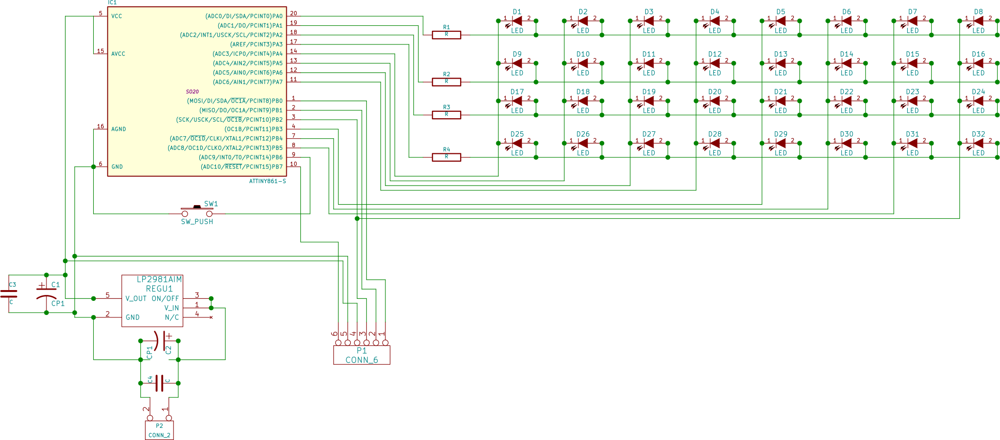
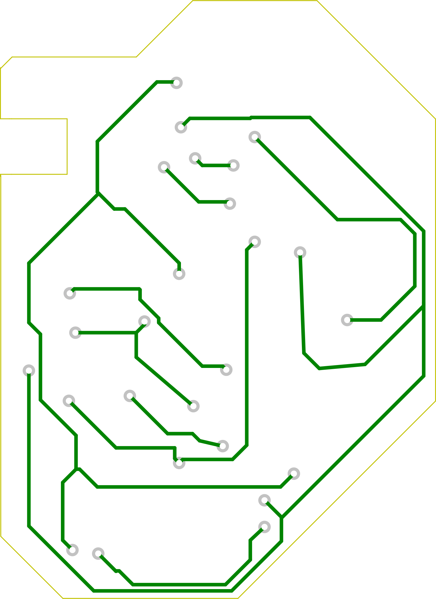
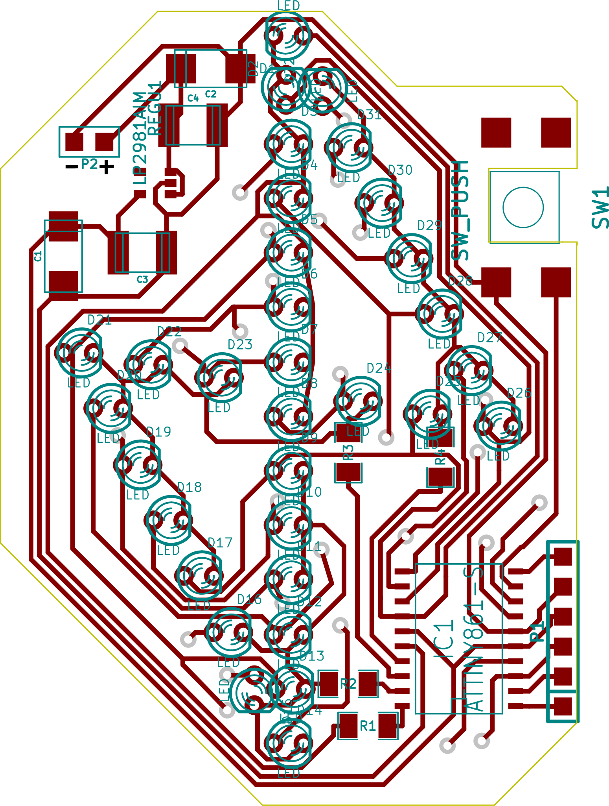
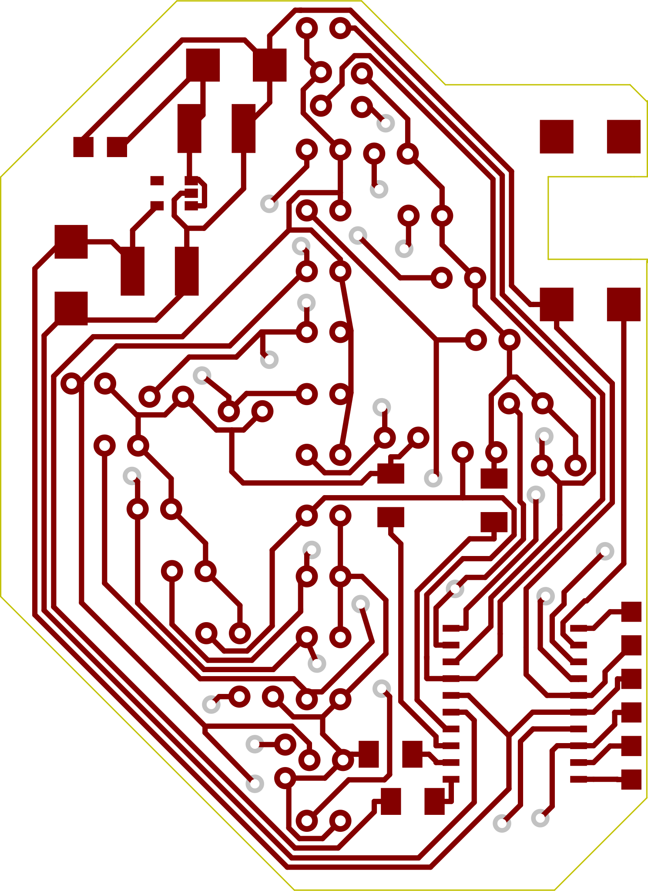
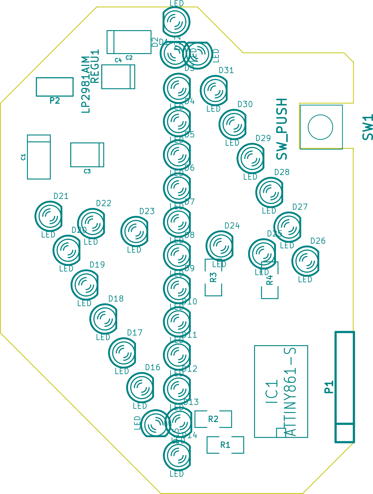
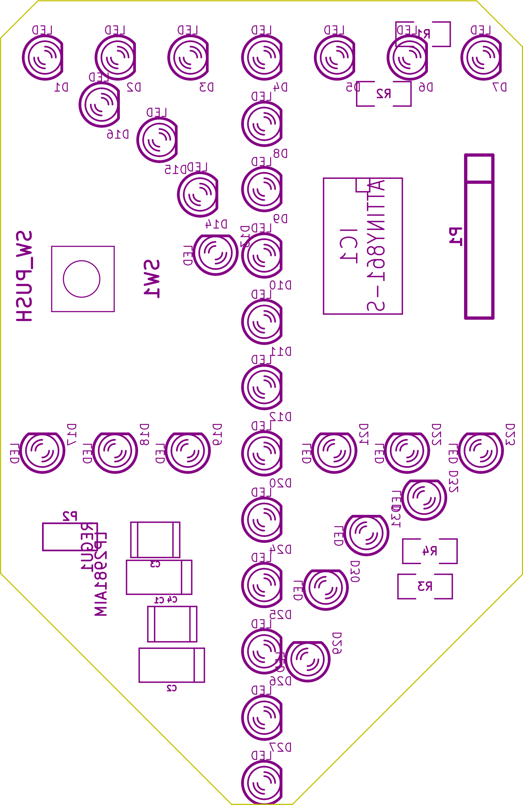

# Salama
Sikin led salamaan ja Otitin led merkkiin koodi, piirilevy ja ohjeet

## Piirilevyt
### Mistä salama koostuu ja miten se toimii
Salaman mikrokontrolleri (mcu) ohjaa ledejä sytyttäen niitä yksi kerrallaan hyvin lyhyeksi aikaa.
Ledejä on 32 ja niille on 110 ohm etuvastukset.
Salamassa on myös 5v regulaattori joka pienentää 9v paristosta saatavan jännitteen viiteen volttiin.
Regulaattori vaatii toimiakseen kondensaattorit molemmille puolilleen.
Levyyn on myös suunniteltu kytkin, jolla voisi vaikka sammuttaa laitteen tai toimittaa muuta toiminnallisuutta, mutta näitä ei ole koodissa toteutettu vielä.
Kuusipinninen liitin on ohjelmointia varten ja sitä kautta ohjelma siirretääm mikrokontrollerille.



### Osaluettelo
  * 1 kpl  ATtiny861a SOIC
  * 32 kpl sininen 3 mm diffusoitu led
  * 4 kpl  110 Ohm 1206 smd-vastus
  * 2 kpl  10 µF tantaalikondensaattori smd (paketti?)
  * 1 kpl  Texas Instruments LP2981AIM5-5.0/NOPB Regulaattori sot23-5
  * 1 kpl  palautuva kytkin (tyyppi?)
  * 1 kpl  9v-paristolle paristoliitin
  * 1 kpl  kuusi pinniä pitkän piikkiriman
  
  lisäksi tarvitset:
  * kaksinapaista johtoa paristoliittimelle
  * kuumaliimaa
  * haalarimerkin :-)
  
### Piirikaavio

1. Läpiviennit
  Kaksipuoleisessa levyssä läpiviennit kuljettavat sähkön levyn puolelta toiselle.

  Mikäli olet saanut levyn yliopiston piirilevypajalta, siinä on luultavasti läpiviennit ja voit ohittaa tämän vaiheen.
  Jos piirilevy on syövytetty elektroniikkakerhon piirilevypajalla siinä ei ole läpivientejä ja ne täytyy juottaa itse.
  Juota siis johdon pätkä kuvassa oleviin reikiin molemmilta puolilta ja katkaise lopuksi mahdollisimman matalaksi.

  Levyn takapuoli. Tältä puolelta näkee mihin juotetaan läpiviennit.

  

2. Vastukset
  Levylle tulee neljä kappaletta 110 ohm vastuksia. Vastukset on merkattu kuviin tunnisteilla R1,R2,R3,R4.

  Pintaliitosvastus on helpoin juottaa siten, että juottaa vähän tinaa ensin piirilevyn toiselle pädille ja sitten vastus    siirretään oikealle paikalle, pidetään paikallaan painamalla jollain lämpöä kestävällä työkalulla ja painetaan kolvilla kunnes tina sulaa. Sitten voit juottaa toisen pädin normaalisti.
  
  Piirilevyn komponenttipuoli

  
  
  
  
  ##### Otit
  
   
  
  TODO: tähän vois panna kuvan kasatusta levystä
  
3. Regulaattori
   Regulaattori kannattaa juottaa ensin, koska se on ahtaassa kolossa. Regulaattorin juottamisessa täytyy myös olla huolellinen, ettei synny oikosulkuja.
   
4. Mikrokontrolleri
Mikrokontrollerissa polariteetti on merkitty lovella kuvassa ja lovella tai pisteellä itse komponentissa.

5. Kondensaattorit
  Tantaalikondensaattorissa polariteetti on merkitty viivalla joka tarkoitta positiivista puolta. Piirilevylle on piirretty paikat neljälle konkalle, kytke kuitenkin vain kaksi C3 ja C4.
  
6. Ohjelmointiliitin
  Juota pätkä piikkirimaa vaakatasoon. Liitin on kuvassa merkitty P1 ja siihen tulee kuusi pinniä.
  TODO: Kuva aiheesta selventäisi..

7. Kytkin
  Tällä hetkellä kytkimelle ei ole ohjelmoitu toiminnallisuutta, mutta sen juottaminen on niin pieni vaiva että se kannattanee kuitenkin tehdä. Kytkin siis asennetaan ylösalaisin niin että kytkimen hattu on levyn tasolla. Tarkoitus on siis että haalarimerkin läpi sitä olisi helppo painaa, mutta kuitenkin sitä ei tulisi vahingossa painettua.
  TODO: Lissää kuvia..
  
8. Ledit
  Ledien juottamisessa on suurin työmaa merkin valmistuksessa. Työtä aiheuttaa lähinnä ledin painaminen merkistä läpi.
  Ensin pitää huomioida polariteetti. Jos olet nähnyt paljon vaivaa että olet laittanut ledit miten sattuu niin voipi harmittaa..
  
  Elektroniikkakerholla on hankittu yleensä mahdollisimman edullisia ledejä joten voisi olla hyvä ennen juottamista testata ledit virtalähteellä. 
  
  Ledien jalat täytyy teroittaa leikkaamalla ne sivuleikkurilla mahdollisimman viistosti, niin että niistä tulee mahdollisimman terävät merkin läpi painamista varten. Leikkaa myös jalat reilusti eri mittaisiksi. Ne on helpompi painaa lapi yksi kerrallaan pihdeillä.
  
  Salaman ylä ja alapäässä on kaksi lediä piirretty niin lähellä toisiaan, että ledejä olisi hyvä vähän viilata jotta ne saa osoittamaan suoraan. (Aikaisemmassa leiskassa ledeillä oli tarpeeksi etäisyyttä mutta ne eivät pysyneet linjassa niin piirsin näin :-) )
  
  TODO: KUVA!!!
  
  Haalarimerkki kannattaa tässä vaiheessa kiinnittää ylimmän ja alimman ledin reistä johtimella kiinni oikealle kohdalle, helpottaa kasaamista. Itse olen kokenut käteväksi työmenetelmäksi että painan johtimen piirilevyn puolelta läpi ja sitten lämmitän sitä merkin puolelta niin että merkkiin sulaa/palaa pieni piste, josta sitten tietää mistä kohdasta ledin jalka kannattaa painaa läpi.

8. Virtajohto
  Virtajohto kannattaa liittää viimeisenä, koska se hankaloittaa levyn käsittelyä. Mitoita virtajohdon pituus niin, että se riittää taskuun missä aiot paristoa säilyttää paikasta johon merkin aiot ommella.
Johdon toiseen päähän juotetaan 9v-paristolle paristoliitin. Elekerholla on ollut huonoja paristoliittimiä joiden johdot ovat katkeilleet herkästi, joten liitin kannattaa ehkä purkaa, poistaa alkuperäiset johdot ja juottaa uusi johto tilalle. Paristoliitin suojataan kuumaliimalla.

  Kiinnitä huomiota polariteettiin. Salamaan ei ole suunniteltu suojaa väärinpäinkytkemisen varalta ja regulaattori palaa välittömästi kun näin tapahtuu. (Suojadiodin lisääminen olisi aika triviaalia) 
  TODO: Tähänki vois panna kuvan!

9. Ohjelmointi
  Ohjelmointiin on ohjeet jäljempänä.
  
10. Lopuksi kun on varmistettu että levy toimii oikein se kannattaa suojata kuumaliimalla niin että ledien terävät jalat peittyvät. Kytkin ja virtajohto kannattaa myös varmistaa hyvin. Merkkiä on vaikea korjata, kun se on kiinni haalareissa.

Todo: Syövytystä varten maskit. Sik maski saattaa löytyä vielä jostain. Otitille ei ole tehty vaan levyt jyrsittiin.

## Ohjelma

Ohjelma siirtyy levylle kätevästi käyttäen arduinoa ohjelmointilaitteena.

```
Salaman ohjelmointiliittimen pinnit keskeltä reunalle:

Nro:  Nimi:   Arduinon pinni (nano):

6:    Reset   10
5:    GND     GND
4:    VCC     VCC
3:    SCK     13
2:    MISO    12
1:    MOSI    11

Muista vetää arduinon Reset ylös. Ardu nollautuu kun sarjaliikenne alotetaan....
```

Src hakemistossa on lediportit_oikein.h ja lediportit_väärin.h tiedostot joista jompikumpi kopioidaan lediportit.h tiedoston päälle mikäli ledit on juotettu vastoin ohjetta. (TODO: nimet ovat ehkä väärin)

Koodin kääntämiseen ja ohjelman levylle siirtämiseen komennot ovat:
```
// kääntäminen
avr-gcc -mmcu=attiny861 vilkutus.c salama.c -I./ -Os -DF_CPU=8000000UL  

// Fläsäys käyttäen arduino-isp:tä
avrdude -c avrisp -p t861 -B3 -P /dev/ttyUSB0 -b 19200 -U flash:w:a.out

// Fuse asetukset käyttäen arduino-isp:tä
avrdude -c avrisp -p t861 -B3 -P /dev/ttyUSB0 -b 19200 -U lfuse:w:0xe2:m -U hfuse:w:0xdf:m
```
